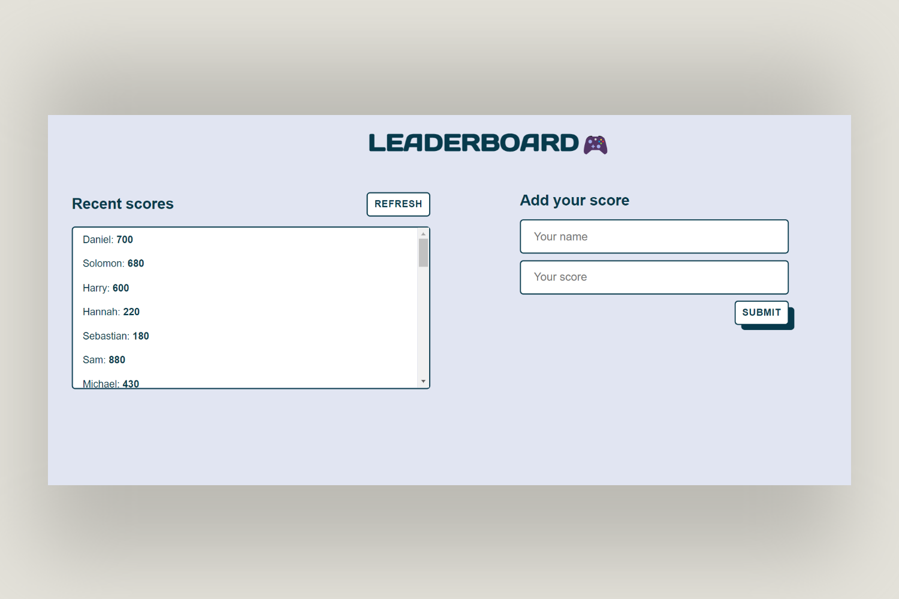

# Leaderboard
> A leaderboard website that displays scores submitted by users. All data is preserved using an external API service.

## Preview

## Live Demo

[Live](https://shyusu4.github.io/Leaderboard/dist/)

## Built with

- HTML/CSS
- JavaScript
- Webpack
- Leaderboard API

## Getting Started

- Clone the repo `git@github.com:shyusu4/Leaderboard.git`
- cd `into` the project
- Run `git pull origin app`
- Run `yarn install` or `npm install` to install dependencies
- On the terminal run `npm run start` open up the live server
- To run tests write `npm run test` on the terminal

## Authors

👤 Shakhrizoda Yusupova

- GitHub: [@shyusu4](https://github.com/shyusu4)
- Twitter: [@shyusu4](https://twitter.com/shyusu4)
- LinkedIn: [Shakhrizoda Yusupova](https://www.linkedin.com/in/shyusu4/)

## 🤝 Contributing
Contributions, issues, and feature requests are welcome!

Feel free to check the [issues page.](https://github.com/shyusu4/Leaderboard/issues)

## Show your support
Give a ⭐️ if you like this project!

## Acknowledgments

- Microverse
- [Leaderboard API service](https://www.notion.so/Leaderboard-API-service-24c0c3c116974ac49488d4eb0267ade3)

## 📝 License

This project is [MIT](https://github.com/shyusu4/Leaderboard/blob/dev/MIT.md) licensed.
